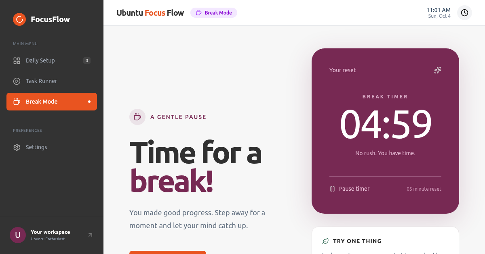

# FocusFlow for Ubuntu

Ứng dụng desktop giúp bạn lên danh sách việc mỗi ngày và tập trung vào một việc tại một thời điểm. Cửa sổ nổi hiển thị việc đang chạy trên các ứng dụng khác; khi chưa chọn việc, nó hiển thị **Break time**.

**0.1.0 Preview:** đã kiểm thử logic và giao diện Electron trên Linux cloud. Chưa chứng nhận cài đặt, thông báo native hay hành vi cửa sổ trên máy Ubuntu thật.



## Tính năng

- Nhắc lên danh sách lần đầu mỗi ngày hoặc khi app chạy qua nửa đêm.
- Thêm, bắt đầu, chuyển việc, tạm nghỉ và hoàn thành; mỗi lúc chỉ một việc chạy.
- Cửa sổ nổi kéo thả bằng thanh trên cùng, hiển thị thời gian và nút hoàn thành.
- Nút ẩn thay cho đóng; yêu cầu đóng của hệ điều hành cũng chỉ ẩn cửa sổ.
- Khôi phục qua app, khay hệ thống hoặc **Ctrl+Shift+F**.
- Break Mode có bộ đếm 5 phút với pause/resume; hết giờ không tự bắt đầu việc.
- Tùy chọn chạy khi đăng nhập Ubuntu trong bản đã cài đặt.
- Dữ liệu cục bộ, không tài khoản, không đồng bộ và không telemetry.

Điều hướng và Break Mode dùng tiếng Anh theo thiết kế; quản lý việc dùng tiếng Việt. Chưa có tùy chọn đổi ngôn ngữ.

## Cài đặt

Yêu cầu Ubuntu x86-64 với desktop X11 hoặc XWayland. Chỉ phát hành gói Debian `amd64`; ARM, Windows và macOS chưa được hỗ trợ.

Tải `.deb` và `SHA256SUMS` cùng phiên bản từ [GitHub Releases](https://github.com/khuebt/reminder-app/releases). Bản Preview được đánh dấu **Pre-release**. Trong thư mục chứa hai file:

```sh
sha256sum -c SHA256SUMS
sudo apt install ./daily-focus_0.1.0_amd64.deb
```

Checksum kiểm tra file so với tài sản cùng release; chưa có chữ ký số độc lập. `apt` cài các thư viện cần thiết. Mở **FocusFlow** từ Applications hoặc chạy `daily-focus`.

## Sử dụng

1. Nhập mỗi việc trên một dòng trong hộp lập kế hoạch, hoặc thêm từng việc ở **Daily Setup**.
2. Chọn **Bắt đầu**. Cửa sổ nổi hiển thị việc đang chạy. Bắt đầu việc khác tạm dừng việc trước và giữ thời gian đã làm.
3. Chọn **Hoàn thành** để về Break time và chọn việc tiếp theo. **Tạm nghỉ** không đánh dấu hoàn thành.
4. Kéo thanh trên cùng để di chuyển cửa sổ nổi. **−** ẩn cửa sổ; khôi phục qua biểu tượng mở cửa sổ ở cuối sidebar, menu khay hoặc Ctrl+Shift+F.

Đóng màn hình chính cũng chỉ ẩn ứng dụng. Chọn **Thoát ứng dụng** trong menu khay để thoát hoàn toàn. Nếu khay không hiện, mở lại FocusFlow từ Applications để khôi phục màn hình chính.

Trong **Settings**, bật **Start when I log in to Ubuntu** để mở khi đăng nhập. App chỉ nhắc khi đang chạy, không phải lịch báo thức khi máy tắt hoặc app đã thoát.

## Dữ liệu, sao lưu, nâng cấp và gỡ

Dữ liệu mặc định: `~/.config/daily-focus/tasks.json`, hoặc thư mục cấu hình tương ứng nếu tùy chỉnh XDG. Autostart: `~/.config/autostart/daily-focus.desktop`.

- Sang ngày mới, danh sách hôm qua được lưu vào lịch sử nội bộ, giữ tối đa 90 ngày. Việc chưa làm **không tự chuyển** sang hôm sau. Chưa có màn hình xem/khôi phục lịch sử.
- Việc đang chạy tiếp tục sau khi mở lại trong cùng ngày, tính cả thời gian app đã thoát. Trạng thái pause của bộ đếm nghỉ không lưu qua lần khởi động lại.
- Ghi dữ liệu qua file tạm; file không đọc được được sao lưu thành `tasks.json.backup-<timestamp>` trước khi tạo danh sách mới. Đây không thay thế sao lưu riêng của bạn.

Thoát app trước khi sao lưu/khôi phục; sao chép thư mục dữ liệu tới vị trí an toàn. Khi nâng cấp, đọc [CHANGELOG](CHANGELOG.md), sao lưu, thoát và cài `.deb` mới bằng `sudo apt install ./<file-moi>.deb`. Giữ cùng định danh `daily-focus` để bảo toàn dữ liệu. Chưa có cập nhật tự động.

Gỡ bằng `sudo apt remove daily-focus`. Trước khi gỡ, tắt autostart trong Settings; nếu đã gỡ, xóa riêng `~/.config/autostart/daily-focus.desktop`. Gỡ gói không xóa dữ liệu cá nhân. Chỉ tự xóa thư mục dữ liệu nếu bạn muốn bỏ toàn bộ danh sách.

## Giới hạn

X11/XWayland và window manager quyết định stacking. Full-screen, màn hình khóa hoặc một số cấu hình Wayland có thể ghi đè always-on-top; thử **Ubuntu on Xorg** nếu gặp lỗi. Tray cần AppIndicator; Ctrl+Shift+F có thể trùng phím tắt khác. Chưa kiểm chứng notification, kéo thả/stacking hay cài `.deb` trên Ubuntu thật. Không có đồng bộ, tùy chỉnh thời gian nghỉ hoặc màn hình lịch sử. Gói `.deb` chưa ký số; Preview không tuyên bố hỗ trợ ổn định mọi phiên bản Ubuntu.

## Phát triển và kiểm thử

Node.js 22.12+ (Node 24 trong CI), npm và Linux graphical session. Từ thư mục checkout:

```sh
npm ci
npx --no install-electron
npm run lint
npm test
npm start
```

`npm run dist` tạo `.deb` trong `dist/`; `npm run pack` tạo app chưa đóng gói. GUI test: `npm run test:desktop`, sau build: `npm run test:desktop -- --packaged`. Runner cần Xorg, dummy driver và dbus-run-session, dùng dữ liệu tạm và tự dừng X server do nó tạo. `--no-sandbox` chỉ dùng cho kiểm thử cloud; startup sản phẩm giữ sandbox.

Xem [phát triển/cloud](docs/development.md), [đóng góp](CONTRIBUTING.md), [release](docs/releasing.md), [changelog](CHANGELOG.md) và [đối chiếu thiết kế](design-qa.md). CI kiểm tra định dạng, logic, GUI, gói Debian và checksum trước khi công bố release.

## Phản hồi và giấy phép

Báo lỗi tại [GitHub Issues](https://github.com/khuebt/reminder-app/issues), kèm phiên bản app/Ubuntu, Xorg/Wayland và cách tái hiện. Không đính kèm dữ liệu riêng tư hoặc token. Lỗi bảo mật: [SECURITY.md](SECURITY.md).

Mã nguồn: [MIT](LICENSE). Font Ubuntu: Ubuntu Font Licence; Lucide: ISC. Giấy phép tài sản nằm trong `src/assets/`. Thiết kế theo dự án MagicPath **Daily Setup** người dùng cung cấp; chạy app không cần MagicPath.
